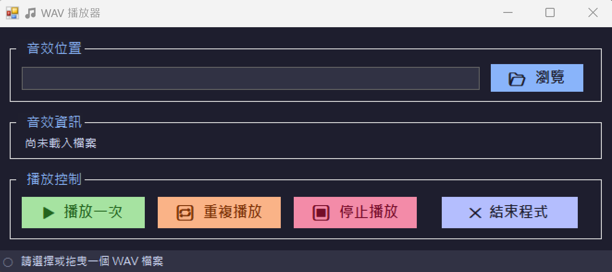
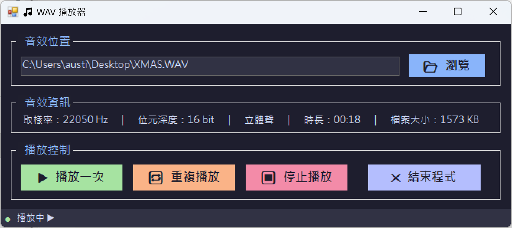

# 🎵 WAV 播放器

一個以 C# Windows Forms 製作的 WAV 音效播放器，支援單次播放、重複播放、停止，以及自動顯示音效檔案資訊。

## 📸 截圖

**初始畫面（未載入檔案）**



**載入檔案後（播放中）**



## ✨ 功能

- **📂 瀏覽**：開啟檔案對話方塊，選取 WAV 音效檔
- **拖曳載入**：直接將 WAV 檔案拖曳到視窗即可載入
- **▶ 播放一次**：播放選取的 WAV 檔案一次
- **🔁 重複播放**：循環播放選取的 WAV 檔案
- **⏹ 停止播放**：停止目前播放中的音效
- **✕ 結束程式**：關閉應用程式（含關閉確認提示）
- **音效資訊列**：載入後自動顯示取樣率、位元深度、聲道、時長、檔案大小
- **狀態列**：底部即時顯示目前播放狀態

## 🛠️ 開發環境

| 項目 | 版本 |
|------|------|
| 語言 | C# |
| 框架 | .NET Framework 4.7.2 |
| UI | Windows Forms |
| IDE | Visual Studio 2022 |

## 🚀 執行方式

1. 以 Visual Studio 開啟 `WAVPlayer.sln`
2. 建置專案（Build → Build Solution）
3. 執行（F5 或 Ctrl+F5）

或直接執行已編譯的 `WAVPlayer/bin/Debug/WAVPlayer.exe`。

## 📁 專案結構

```
WAVPlayer/
├── Images/                        # 截圖
│   ├── sample.png                 # 初始畫面截圖
│   └── sample1.png                # 播放中截圖
├── WAVPlayer/
│   ├── frmWAVPlayer.cs            # 主要邏輯（事件處理、深色主題、WAV 解析）
│   ├── frmWAVPlayer.Designer.cs   # UI 控制項配置
│   ├── Program.cs                 # 程式進入點
│   └── Properties/
└── WAVPlayer.sln
```

## 📖 使用說明

1. 啟動程式後，點擊「**📂 瀏覽**」選取 WAV 檔案，或直接將檔案**拖曳**到視窗
2. 載入成功後，「音效資訊」區塊會顯示該檔案的技術規格
3. 點擊「**▶ 播放一次**」播放音效，或「**🔁 重複播放**」循環播放
4. 播放中可隨時點擊「**⏹ 停止播放**」停止
5. 底部狀態列會即時反映目前狀態（就緒 / 播放中 / 已停止）

## 📄 授權

本專案採用 [MIT License](LICENSE.txt) 授權。
